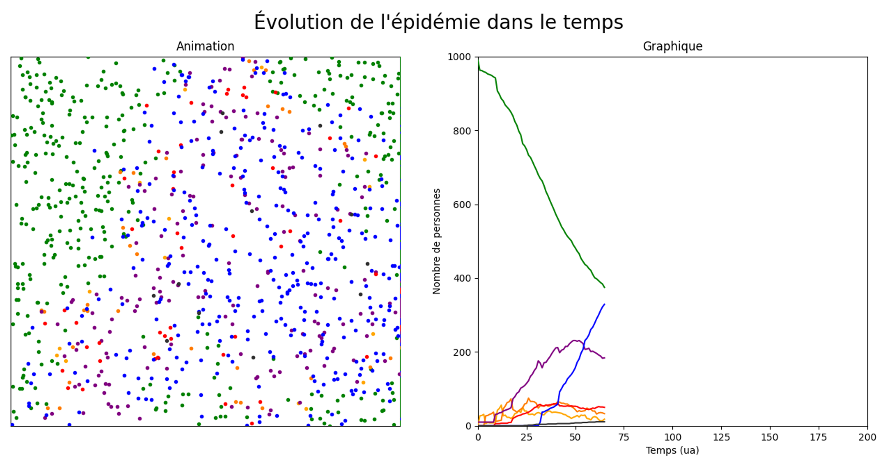
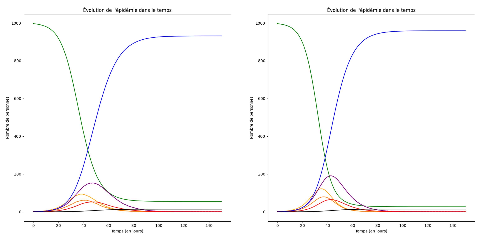
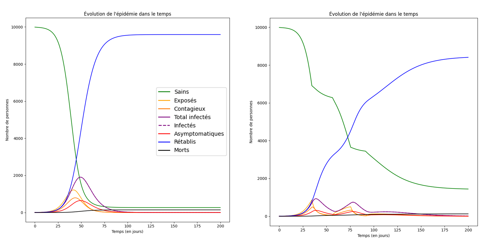
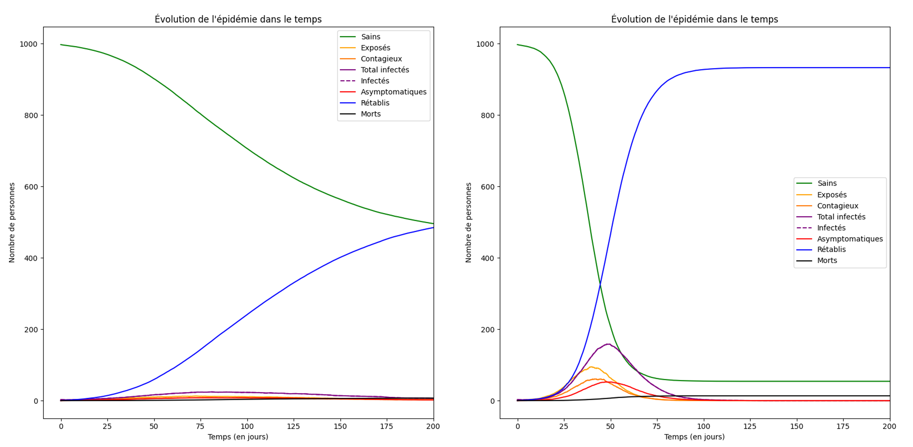
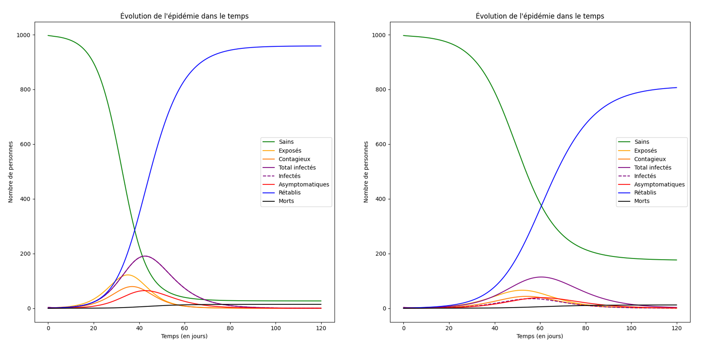

# Pandemic Spread Model

Discrete and mathematical models of a pandemic spread coded in Python. This project was made for the TIPE, a personal work presented at the oral exam to apply for the French engineering schools. Therefore, most of the comments and naming is in French.

More information available in the [docs](docs/) folder where the exam deliverables can be found.

### Discrete Model
The "discrete" model is people represented by moving dots in a square. They bounce off the edges and can transmit the virus one to each other if they get too close.

> Screenshot of the moving dots animation and population state graph.

### Differential equation model
The mathematical problem reprents the problem with non-linear differential equation system which is solved with Euler method. It is deeply described in the [report](docs/report.pdf) file.

> Comparison of the discrete model on the left and the mathematical one on the right with "similar" parameters.

### Outbreak control policies
The project aims at searching the influence of different outbreak control policies, such as global lock down, quarantine of infected persons or restraining people movement within the population. Check the [slides](docs/slides.pdf) to see more of it.

#### With and without lockdown

#### With and without movement limitation

#### With and without infected quarantine

